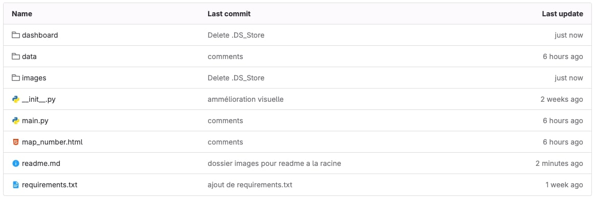
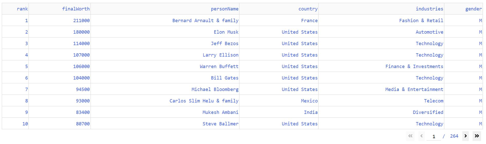
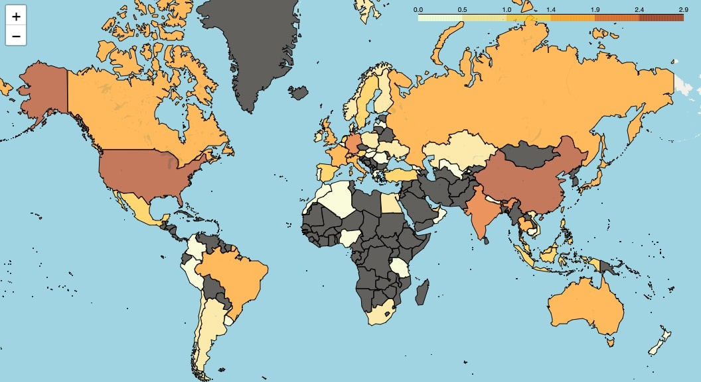
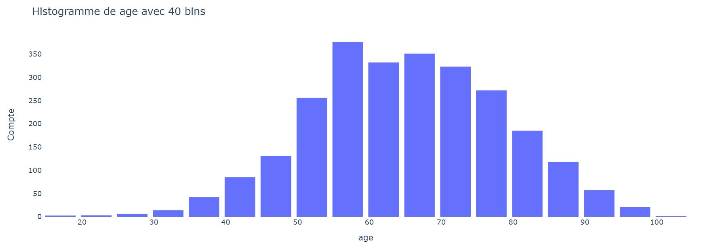
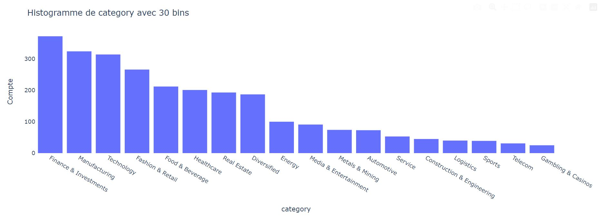
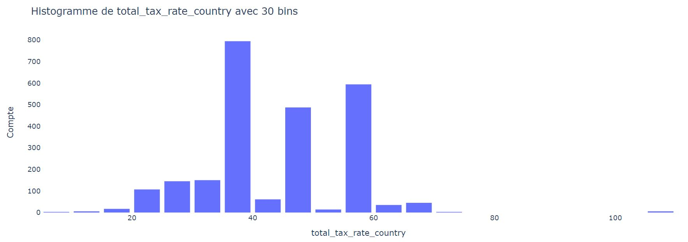
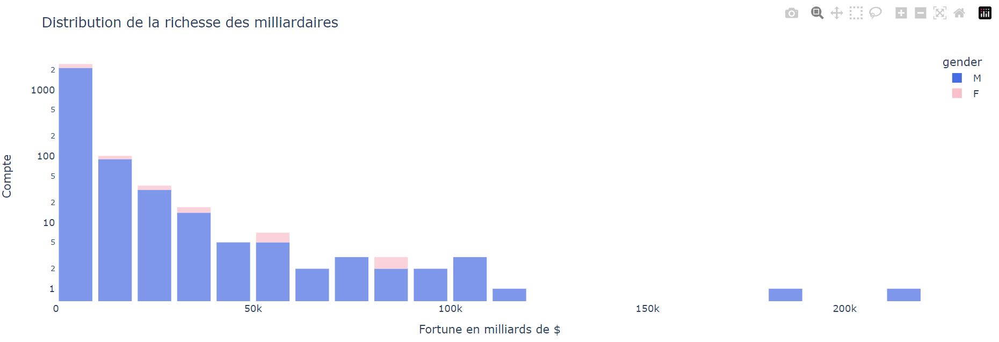
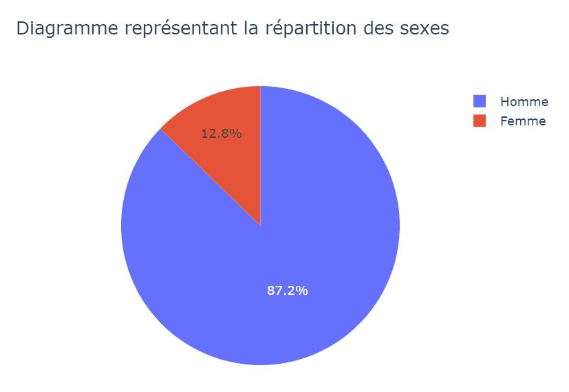
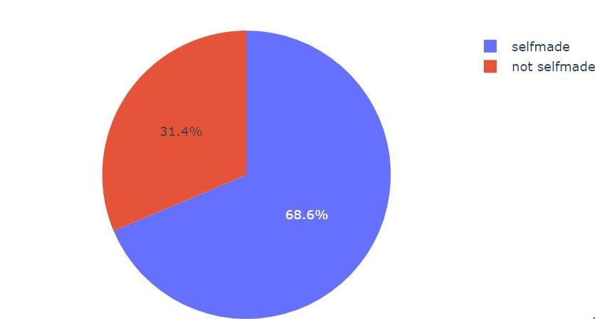

# Notice d'utilisation de l'application dash sur les milliardaires


Cette application a pour objectif de collecter des informations sur les individus les plus fortunés du monde. De plus, elle vise à présenter visuellement ces données de manière précise et conviviale sur le site. Le projet est disponible ici: https://git.esiee.fr/texiera/projet-python-ds/-/tree/main


### Guide de l'Utilisateur

**Mise en route:**

Avant de lancer l'application, il faut installer tous les packages qui se trouvent dans le fichier requirements.txt. Pour cela, il faut effectuer la commande: $ python -m pip install -r requirements.txt
Pour lancer l'application, il suffit de lancer le fichier main.py présent dans le répertoire téléchargé.

Puis, rendez-vous sur le lien de votre localhost sur le port indiqué dans la console.

**Architecture du site:**

Le site est divisé en quatre sections principales. La première section est consacrée au dataset du jeu de donnée des milliardaires avec les colonnes les plus pertinentes.


La deuxième section concerne la carte interactive qui représente les données spatialement. La troisième section comporte un histogramme personalisable, où les données peuvent être changées manuellement grâce à la barre de sélection.


La dernière section est consacré à quelques graphiques intéressant dans l'analyse des données.

### Analyse des données

Qui sont les milliardaires?

**Statistiques descriptives**

Premièrement, le jeu de données sélectionné provient de : https://www.kaggle.com/datasets/nelgiriyewithana/billionaires-statistics-dataset.

Le jeu de données renseigne **2640 milliardaires** les plus riches à travers le monde. Pour chacune de ces personnes, nous avons les informations suivantes:
>rang, fortune, industrie, nom de la personne, age, pays, sexe, entreprise etc ...

Dans un premier temps, analysons les statistiques descriptives de ce jeu de données.

**moyenne:** 
| fortune (Mds $) | âge          
| :--------------- |:---------------:
| 4.623 |   65  

On observe que la moyenne de la fortune de ce jeu de données est de 4.6 Mds $. Cette donnée seule n'indique rien ; cependant, l'écart type de cette donnée est de 9.8, ce qui indique que le jeu de données est disparate. Par exemple, la fortune maximale atteint 211 Mds de $. La médiane de la fortune s'élève à 2.3 Mds de $. Ces caractéristiques montrent que la distribution de la richesse est bien plus importante pour les valeurs "faibles". Cela indique que les valeurs extrêmement élevées sont relativement peu nombreuses.

En ce qui concerne l'âge, la moyenne est relativement élevée : 65 ans. Dans ce cas, la médiane et la moyenne se confondent. De plus, l'écart type vaut 13.3. À priori, ces résultats ne sont pas étonnants ; les milliardaires sont dans la plupart du temps des personnes ayant une expérience professionnelle assez longue et riche pour pouvoir accumuler ce montant d'argent. Cependant, il existe des valeurs extrêmes intéressantes à souligner. En effet, le plus jeune milliardaire a 18 ans. Au contraire, le milliardaire le plus âgé a 101 ans. On en conclut que la population des milliardaires est une population avec une majorité de seniors.

**Données visualisables**

**Carte:**

Ce jeu de données est riche, il contient des données géographiques, soit le pays dont est issu chaque milliardaire. Ces données sont visualisables et sont beaucoup plus lisibles sur une carte. C'est pour cela que nous avons décidé de représenter sur une carte pour chaque pays, le nombre de milliardaires associés à chaque pays.



Cette carte permet d'un coup d'oeil de comprendre dans quel pays sont concentrés les milliardaires. Les régions du monde où il y a le plus de milliardaires sont: _l'Amérique du nord, l'Europe et l'Asie de l'Est_. Au contraire, l'Afrique et le Moyen-Orient ne comporte très peu de milliardaires. De manière caricaturale, on pourait faire un lien entre la distinction des pays du "Nord" et du "Sud" avec le nombre de milliardaire.
Ici, on entend le terme du "Nord" au sens de:
>"Le Nord désigne l'ensemble des pays industriels et développés. Il regroupe l'Amérique du Nord, l'Europe, l'Australie, la Nouvelle-Zélande et le Japon."

La corrélation entre les pays développés et le nombre de milliardaire parrait intuitive car ces pays-ci propose un cadre plus épanouissant pour favoriser des activités économiques. La santé financière et la stabilité politique d'un pays influe sur le niveau de richesse des habitants.

Deuxièmement, nous pouvons noter qu'il n'y a pas nécessairement une corrélation entre le nombre d'habitants d'un pays et le nombre de milliardaires. En effet, un bon exemple est l'Inde qui est le pays le plus peuplé du monde mais qui n'a pas autant de milliardaires que la Chine ou les Etats-Unis par exemple, pourtant moins peuplé. Un autre exemple flagrant, est l'Ethiopie qui est un pays de plus de 100 millions d'habitants mais n'ayant aucun milliardaire vivant là-bas. Une conclusion hative pourrait être formulé en disant que plus un pays est peuplé, plus il a de probabilité d'accueillir un grand nombre de milliardaires. Cette idée assure que les milliardaires sont des individus exceptionels, au sens premier du terme, et que la loi des grands nombres favorise le nombre d'individu avec des caractèristiques extrèmes. Cette idée est donc fausse. Le nombre de milliardaires d'un pays dépend donc de plusieurs facteurs: la santé politique et économique d'un pays, le cadre de vie etc...

**Histogramme représentant les ages des milliardaires:**



Cet histogramme appuie les conclusions établies précédemment vis-à-vis des statistiques descriptives. Comme prévu, la population des milliardaires est relativement agée. La distribution peut être assimiler à une gaussienne centré vers 60 ans. On observe tout de même qu'il très peu de milliardaires en dessous de 30 ans.

**Graphique en barre représentant les catégories/industries dans lesquels travaillent les milliardaires:**


On constate une très grande variété d'industrie pour les milliardaires. Cependant, la distribution n'est pas uniforme. Certaines industries sont plus représentés comme la _finance, le luxe, la technologie etc..._

**Histogramme représentant la répartition des milliardaires selon le taux de taxation des pays:**



Les politiques de taxation des pays sont plus ou moins clémentes avec les grosses fortunes. En effet, les milliardaires sont les plus gros contributeurs de l'État. Cependant, les milliardaires ont la possibilité financière de s'installer dans n'importe quel pays. Si on omet les contraintes culturelles, linguistiques et environnementales de chaque pays, un milliardaire peut choisir dans quel pays il veut résider. C'est pour cela qu'ils constituent une pression pour l'État qui veut récupérer un maximum d'argent provenant de ces personnes. Néanmoins, si l'État taxe trop les milliardaires et que le cadre de vie n'est pas satisfaisant, ceux-ci peuvent partir dans un autre pays.


On constate que la majorité des milliardaires résident dans des pays où la fiscalité n'est pas nécessairement avantageuse. En réalité, les milliardaires habitent dans les pays où ils ont construit leur _"business"_. On en conclut que certains milliardaires ont une stratégie de conservation de leur patrimoine en se logeant dans des pays où la fiscalité est avantageuse. Cependant, cela ne concerne pas la majorité. En effet, d'autres résident dans des pays qui taxent relativement beaucoup.

**Histogramme de répartition des richesses des milliardaires (échelle logarithmique):**



Sur cet histogramme, nous observons les conclusions précédemment tirées. C'est à dire que la grande majorité des milliardaires possèdent moins de 10 Mds de $. On constate que les plus riches de ce monde sont vraiment bien plus riche que le reste des milliardaires et à fortiori sur le reste de la population mondiale. Il existe une grande inégalité au niveau de la richesse sur l'ensemble des fortunes des milliardaires. De plus, on peut noter que les femmes sont sous représenté dans la population des milliardaires.

**Diagramme de la répartition des sexes chez les milliardaires:**



Au niveau de la population mondial, la répartition homme femme est au alentour de 50%. Hors, dans ce cas-ci les hommes sont beaucoup plus représentés que les femmes (87.2%). Ce graphique illustre les inégalités sociales entre les hommes et les femmes. Si il y'avait une égalité parfaite entre les hommes et les femmes dans le monde, il y aurait également une proportion pratiquement égales d'hommes et de femmes milliardaires. Les inégalités sociales se manifestent dans toutes les couches de la société même dans celles où les individus sont les plus fortunés.

**Diagramme représentant la proportion des milliardaires qui se sont faits eux-mêmes**



Premièrement, le terme _"selfmade"_ signifie que le milliardaire n'a pas hérité d'un capital important à sa naissance. Cette donnée n'est pas d'une qualité irréprochable puisque cela peut-être parfois arbitraire selon les définitions de ce mot. À priori, on pourrait penser que dans la plupart des milliardaires sont des héritiers de fortune, d'empire créés depuis plusieurs générations. Néanmoins, ce n'est pas le cas plus de 68% des milliardaires sont des "selfmades". Ce qui indique une dynamique des classes spectaculaire en ce qui concerne la classe sociale des milliardaires. Il faut nuancer cette idée car le diagramme n'indique en aucun le patrimoine de base des milliardaires. En effet, _"selfmade"_ ne veux pas dire non plus partir de rien.


On peut conclure que la population des milliardaires peut être caractérisée en majorité par des hommes agés vivant dans les pays développés qui se sont construit leur richesse eux-mêmes.

### Guide du développeur

Premièrement, il est important de se familiariser avec la structure du code afin de le modifier par la suite et rajouter des fonctionalités. Nous allons faire un tour des différents fichiers, expliquer leur rôle un à un pour avoir une vision du code globale facilité.

**main.py**:

```python
from dashboard.app import app

if __name__ == '__main__':
    app.run_server(debug=False)
```
Il s'agit du fichier de base pour lancer n'importe quel code python. Ce fichier est complet, il permet de lancer le serveur Dash. Aucune modification n'est à apporter sur ce fichier. Ce fichier appelle **app.py** disponible dans le répertoire dashboard.

**app.py:**

```python
from dash import Dash
from dashboard.layout import app_layout

app = Dash(__name__)
app.layout = app_layout
```

Ce fichier a pour but d'instancier et de lancer l'app Dash. Ce fichier a besoin de la structure de l'app Dash, il appelle donc le fichier **layout.py** dans le répertoire dashboard.

Pour pouvoir récupérer les données, pour ensuite les traiter. Il faut se rendre dans le répertoire **data**.

**get_data.py:**

```python
import pandas as pd

def get_df():

    file_name = "data/billionaires.csv"
    df_billionaires = pd.read_csv(file_name)
    
    return df_billionaires
```

Ce fichier a pour rôle de récolter les données présentes dans _billionaires.csv_ avec la fonction get_df().

**layout.py:**

Il s'agit du fichier le plus dense de ce projet. En effet, il concentre le traitement des données et la structure de l'app Dash. Ce fichier concerne la disposition de l'application.

```python
#Structure of the site
app_layout = html.Div([

    #Top of the site
    html.Header([
        html.H1("Données sur les milliardaires",className="title"),
        html.Img(src="assets/money_icon.png",className="title_logo"),
    ]),

    #Dataframe displayed on the site
    html.Div([
        dash_table.DataTable(data=df_simplified.to_dict('records'), page_size=10),
        ],className="df"
    ),
    
    #Map section
    html.H1("Nombre de milliardaires par pays en échelle logarithmique",className="title"),

    html.Div([
        html.Iframe(id="map1",srcDoc = open('map_number.html','r').read(),
                     width='75%',height='600',className="map_css")
        ],className="map_container"
    ),
    
    
    #Customisable histogramm section
    html.H1("Histogramme personalisable",style={"padding-top":"2.5%"}),
    #Selection bar of the x axis of the chart code inspired on https://dash.plotly.com/basic-callbacks
    html.Div([
        html.Div("Données à sélectionner: ",style={"margin":"0.4%"},className="selector_x_title"),
        dcc.Dropdown(
            special_features,
            'age',
            id='xaxis_column',
            style={"width": '50%'}
        ),
    ],className="selector_x",style={"display": 'flex',"flex-direction": "row","appearance": "none"}),
    
    html.Div([
        html.Div("Nombres de bins: ",style={"margin":"0.4%"},className="selector_x_title"),
        html.Div(dcc.Input(id='input_bin',value=30, type='number'),style={"margin":"0.5%"},className="bin_input"),
    ],style={"display": 'flex',"flex-direction": "row","appearance": "none"}),
    
    #graph that can be changed according to the selection of the user
    dcc.Graph(id="indicator_graphic",className="custom_histo"),

    # other graphs...
    html.H1("Autres graphiques..."),
    dcc.Graph(id="f1",figure=fig_histo),
    html.Div([
        dcc.Graph(id="f2",figure=fig_pie_gender,style={"width":"45%"}),
        dcc.Graph(id="f3",figure=fig_pie_selfmade,style={"width":"50%"})
    ],className="diagram_graphs",style={"display": 'flex',"flex-direction": "row"}),
])
```

Dans cet extrait de code, nous voyons la disposition des éléments mis sur l'application. Il faut voir cette structure de code comme des balises HTML. Chaque élément apparaît sur l'application les uns en dessous des autres en fonction de leur ordre dans le code. 

L'application est donc composé d'une section "Header", haut de page.

```python
#Top of the site
html.Header([
    html.H1("Données sur les milliardaires",className="title"),
    html.Img(src="assets/money_icon.png",className="title_logo"),
]),
```

Il s'agit de la banière de l'application composé d'un titre et d'un logo.

Ensuite, le site comporte le code pour afficher le dataframe, la carte, et les histogrammes. Il s'agit à chaque fois de la même mécanique. Une _"Div"_ HTML est créé pour accueillir l'élément. Chaque élément est identifiable avec un _"className"_ différent pour pouvoir les styliser en css.

La subtilité réside dans l'histogramme personalisable. En effet, cet histogramme nécessite d'appeler des callbacks pour ce mettre à jour en fonction des entrées sélectionnées. Les callbacks sont appelés avec register_callbacks(df_billionaires).

Pour ajouter du contenu sur l'application, il faut donc modifier ce fichier dans la partie du layout.

**callback.py:**

Ce fichier gère les callbacks. En particulier pour actualiser l'histogramme personalisable.

```python
def register_callbacks(df_billionaires):

    @callback(
        Output('indicator_graphic', 'figure'),
        Input('xaxis_column', 'value'),
        Input("input_bin","value")
    )

    def update_graph(xaxis_column_name,bin):

        fig = px.histogram(df_billionaires,
                           x=xaxis_column_name,nbins=bin).update_layout(title="Histogramme de "+str(xaxis_column_name) + " avec "+ str(bin)+ " bins",
                            plot_bgcolor='white',bargap=0.15,yaxis_title="Compte").update_xaxes(categoryorder='total descending')
        
        return fig
```

Ce fichier gère uniquement l'histogramme. Si d'autres callbacks venaient à être intégrer il faudrait donc modifier ce fichier.

**assets:**

Enfin, les aspects visuels du site sont présents dans le fichier _"stylesheet_app.css"_. Toutes les images utilisées pour illustrer ce readme sont aussi présentes dans assets.


